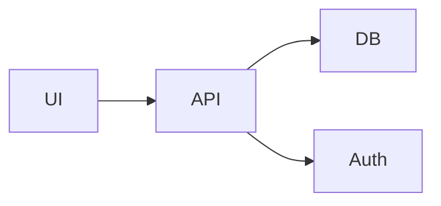

# How Can I Make Others Use My Code?

## Docs Anatomy

All of our documentation is stored and handled in `docs/`. The directory tree below highlights the main content:

    docs
    ├─ conf.py
    ├─ index.rst
    ├─ architecture         # Directory for component-based documentation
    │  ├─ index.rst
    │  ├─ overview.md       # High-level description of the overall architecture
    │  └─ components        # Directory for detailed description of the components
    │     ├─ component.md   # Detailed description of a component
    │     ├─ ...
    │     └─ index.rst
    ├─ code                 # Directory for code-based documentation
    │  ├─ index.rst
    │  ├─ cpp_pkgs          # Directory for C++ package documentation
    │  │  ├─ index.rst
    │  │  ├─ cpp_pkg.rst    # Code documentation of a C++ package, which includes directives and enrichment content
    │  │  └─ ...
    │  └─ py_pkgs
    │     ├─ index.rst             
    │     └─ py_pkg.rst     # Code documentation of a Python package, which includes directives and enrichment content
    │     └─ ...
    └─ usage               
       └─ examples          # Directory for solution showcase and examples  
          ├─ index.rst
          ├─ example.md     # Example of using a feature or some features from a package
          └─ ...

Each directory contains an `index.rst` file (**reStructuredText (reSET)** file), which serves as an entry point. In each index file, we can reference index files from subdirectories. In this way, it is possible to create pages and subpages in order to make a structured and organized documentation web page. The main `index.rst` is located in the source directory of the documentation setup. We can also use Markdown within reStructuredText. This allows some specific documentation intended for display on GitHub to be included in the main documentation. `conf.py` is the central configuration file that defines how the documentation is built and styled. It sets project details, enables extensions, chooses the theme, and controls paths and output formats. Essentially, it's the settings file that tells **Sphinx** what to include and how to present it.

### Main Entry Point

***

This is the landing section of the project with an overview. A good overview briefly states the scope, purpose, and goals of the project. The main problem the project solves, the target audience, and any notable features or technologies used should also be mentioned. This helps readers decide whether the project meets their needs before diving into details.

### Architecture

***

Here, an overall architecture is presented. If this project delivers a certain solution, this section should explain what this solution entails. Diagrams (generated by Mermaid) are used to visually explain the architecture. This section contains the following:

*   A diagram with an explanation of the overall architecture and the high-level components
*   Info about how these components interact
*   (Recommended Optional) Additional diagrams with detailed explanations of the components
*   (Optional) A list of constraints and trade-offs

Example Mermaid snippet (in an `.rst` or `.md` doc):


Note that each component should have its own documentation page(s) describing its role, responsibility, use, configuration, and diagrams where useful. More details can be added if necessary.


### Code Documentation
----------------------
Code documentation primarily depends on comments/docstrings written in the code. For you as a developer, if you are writing code in:

- **C++**: Use Doxygen-style comments (check [Doxygen Documenting Code Guide](https://www.doxygen.nl/manual/docblocks.html)); **Doxygen** produces XML-based documentation, which is used by **Breathe** to integrate into **Sphinx**. **Breathe**-specific directives are used (e.g., `doxygenclass`) to achieve this integration.
- **Python**: Use NumPy-style docstrings (check [NumPy Style Guide](https://numpydoc.readthedocs.io/en/latest/format.html)). **Sphinx** extensions (e.g., `automodule`) are used to pull documentation from docstrings.

A C++ example from `math_utils.hpp`:

```cpp
/**
 * @brief Calculate the square of a number.
 * @param x The number to be squared.
 * @return The square of the input number.
 */
double square(double x);
```
An equivalent Python example from `math_utils.py`

```python
def square(x):
    """
    Calculate the square of a number.

    Parameters
    ----------
    x : float or int
        The number to be squared.

    Returns
    -------
    float or int
        The square of the input number.
    """
    return x * x
```

**Sphinx** uses **reStructuredText (reST)** as its markup language to generate structured documentation. Therefore, our documentation should technically be defined in `.rst` files. In these files, we declare the **directives** and **extensions**.

Directives are special instructions in reST that tell **Sphinx** how to include and format content. An extension is a Python module that provides additional features for **Sphinx** projects. 

For example, to use **Sphinx** on C++ code, `autodoc` cannot be used, since it is made for Python. But we can use **Breathe**’s set of directives. They may not be as powerful as `autodoc`, but are still useful in our use case.

```rst
Math Utilities
--------------

.. doxygenclass:: math_utils::Calculator
    :project: cpp_pkg
    :members:
```

To use **Sphinx** on Python code, the `autodoc` extension is often used to automatically pull in docstrings from the source code:

```rst
.. automodule:: py_pkg.math_utils
   :members:
   :undoc-members:
   :show-inheritance:
```

This directive tells **Sphinx** to document the `math_utils` module, including all its members—even those without docstrings—and to show class inheritance.


All this is nice, but writing docstrings/comments alone and using directives and extensions is not sufficient for proper documentation. While some of them are powerful in automatically extracting and displaying documentation from source code, they work best when combined with additional narrative content written in reStructuredText. Writing introductions, explanations, usage examples, and conceptual overviews alongside directives and extensions helps provide context, guide the reader, and make the documentation more accessible and educational. This blend of auto-generated and hand-written content results in a more complete and user-friendly documentation experience. Here is an example of how you can enrich the documentation:

```rst
Math Utilities
--------------

The ``math_utils`` namespace provides a collection of basic mathematical operations commonly used in scientific and engineering applications. At the core of this module is the ``Calculator`` class, which offers a simple interface for performing arithmetic operations such as addition, subtraction, multiplication, and division. These methods are implemented with clarity and include basic error handling—for example, division by zero raises an exception to prevent undefined behavior.

This utility is intended to serve as a foundational component in larger C++ projects where lightweight and reusable mathematical functionality is needed. While the operations themselves are straightforward, encapsulating them in a class structure promotes modularity and testability.

.. doxygenclass:: math_utils::Calculator
   :project: cpp_pkg
   :members:
```

You can also add Mermaid diagrams, if needed.

Remember that the file structure in documentation is package-based, i.e., each package in `lib` has a corresponding `.rst` file in the documentation. In case subdirectories are needed, each subdirectory should contain an `index.rst`. These files are used to include contents and enforce a tree-based structure of the documentation.

### Usage
---------
In order to quickly start working with the project and provide value for users, a set of examples must be provided. Each example should ideally include an explanation of a use case, a demonstration, and output explanation. The examples should highlight the main features of your solution and explain the usage in a user-friendly way. This may also provide some guidance on how to develop a user-friendly solution.

## Documentation Workflow
1. Document your code using the appropriate style (Doxygen for C++, NumPy for Python).
2. Create a reST file in `/docs/code/` with the package name you want to document. (The current template has two code documentation subdirectories, one for C++ packages, the other for Python packages)

   - **For a C++ package**:  
     Since **Sphinx** relies on **Doxygen** to get the documentation, it is required to specify the files and/or directories that contain documented source files in **Doxyfile**. Find the key `INPUT`in **Doxyfile**, and add the appropriate paths.

   - **For a Python package**:  
     **Sphinx** can access your Python packages based on the paths you specify in `conf.py`.

3. Add any necessary directives, extensions, and content enrichments. See an example here: [cpp_pkg.rst](/docs/code/cpp_pkgs/cpp_pkg.rst).
4. (Recommended optional) Build docs locally and check them in `/build/html` before pushing:
   ```bash
   doxygen Doxyfile # If there are any C++ packages
   sphinx-build -b html docs build/html
   ``` 
5. Push changes – GitHub Actions will automatically:
   - Build and deploy documentation when successfully merging into main.